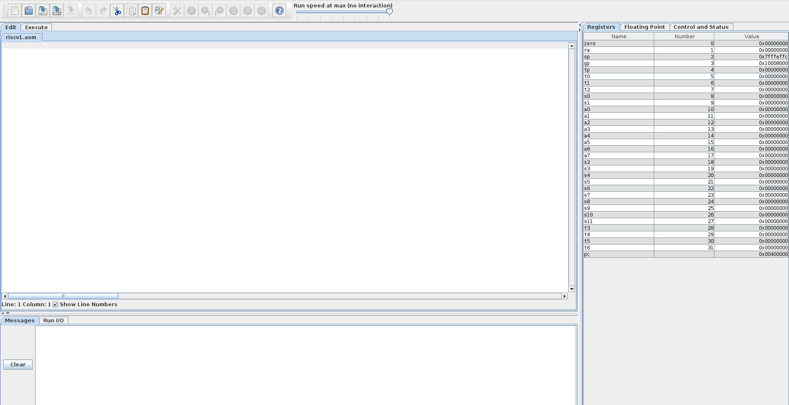
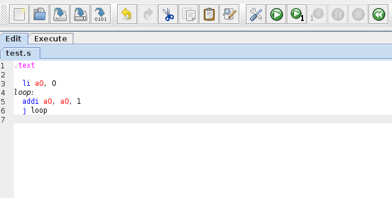
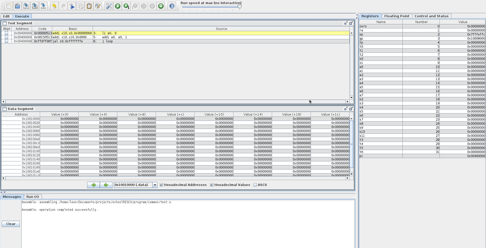
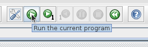
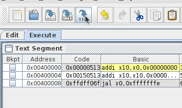
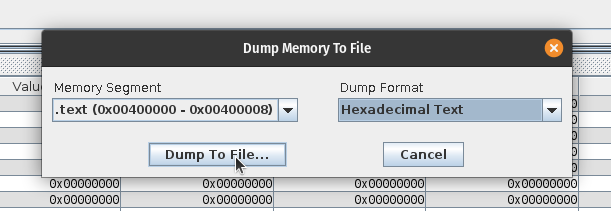
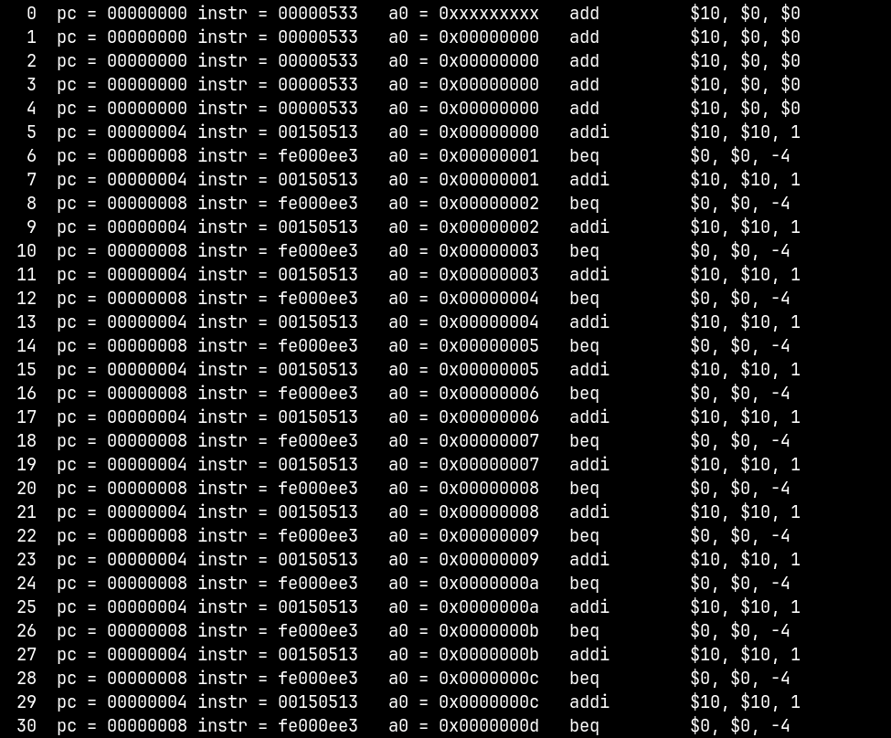
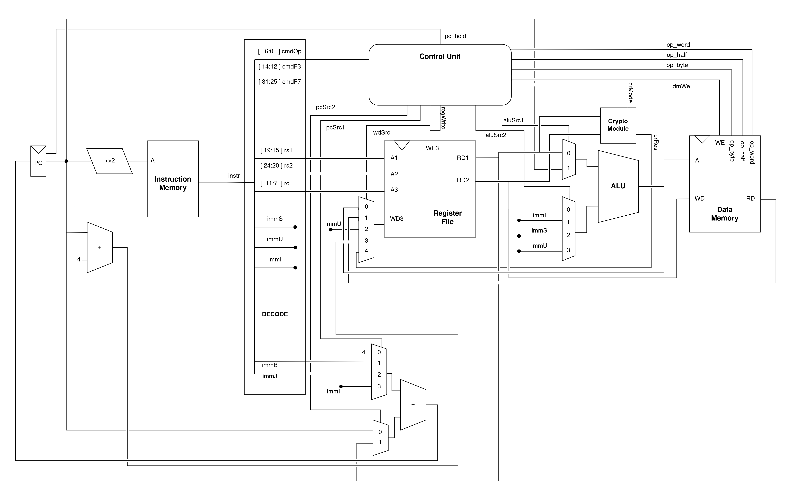

# Документация

**Авторы**: Фролов Кирилл, Мирошниченко Лев

## Структура репозитория

В ветке "rv32i" представлена версия ядра schoolRISCV, поддерживающее базовый набор инструкций RV32I, а в ветке "master" представлена версия расширенного ядра schoolRISCV с добавленным криптографическим модулем.

### Содержимое репозитория:
* **board** - папки с заготовленными проектами Quartus для различных плат ПЛИС (название папки соответсвует названию платы);
* **doc** - документы со спецификацией архитектуры RISCV;
* **install** - различные инструменты для работы с проектом, которые можно установить;
* **materials** - результаты моделирования, портирование, ресурсного и временного анализа базового и расширенного ядер schoolRISCV с программами, выполняющими криптографические операции;
* **program** - папки с разработанными программами, каждая папка называется аналогично содержащейся в ней программе (в каждой папке есть файл main.S или *.asm с текстом программы на языке ассемблер и файл program.hex с программой, представленной в машинном коде);
  * в ветке "master" отдельно представлена папка "native_crypto" с программами, использующими криптографические инструкции;
  * в ветке "rv32i" отдельно представлена пака "prog_crypto" с программами, выполняющими криптографические операции на базовых инструкциях набора RV32I;
* **src** - файлы с описанием ядра на языке Verilog;
* **submodules** - файлы с описанием криптографического модуля;
* **testbench** - файлы с описанием тестбенчей, разработанных для моделирования работы ядер

## Разработка программ

Для разработки программ потребуется использовать ассемблер RARS (`rars1_4.jar`
находится в директории `program/common`, для запуска использовать команду `java
-jar rars1_4.jar`).

Интерфейс RARS выглядит следующим образом:

Рассмотрим ассемблирование программы на простом примере, для начала необходимо
разработать программу в текстовом редакторе:

Для ассемблирования необходимо нажать кнопку "Assemble the current file":

В результате программа перейдёт в следующее состояние:

Также программу можно просимулировать и отладить непосредственно в RARS, для
этого необходимо нажать кнопку "Run" справа от кнопки "Assemble the current
file":

Для дампа программы в шеснадцатеричный формат необходимо нажать кнопку "Dump
machine code":

И выбрать формат "Hexadecimal Text":

Важно:

RARS не умеет обрабатывать инструкции криптографического расширения, для их
использования нобходимо вставить инструкцию на машинном коде в результирующий
файл дампа.

## Симуляция ядра

Для симуляции ядра потребуется программа в формате `.hex`, её получение подробно
описано в разделе `Разработка программ`.

Создайте отдельную папку для Вашей программы в директории `program/` и
скопируйте в неё файл `Makefile` из любой другой директории в `program/`. Далее
добавьте в новую директорию прогрумму в формате `.hex`.

Для старта симуляции перейдите в созданную директорию и введите команду `make
icarus`. Результат будет, примерно, следующий (симуляция описывает процесс для
каждой инструкции):

## Синтез ядра

### Для произведения синтеза ядра необходимо:
1. Предварительно установить приложение Quartus;
2. Перейти в папку board, а затем в папку с названием платы ПЛИС, на которую будет производится портирование;
3. Переименовать содержащиеся в папке файлы путем удаления символа "_" из расширения файла (Пример: *.qpf_ -> *.qpf);
4. Запустить программу Quatus и в верхнем меню программы нажать кнопку "File" и из выпавшего меню нажать кнопку "Open Project", после чего выбрать файл *.qpf в папке из пункта 2;

5. Убедиться, что все файлы из папки "src" добавлены в проекта, в обратном случае добавить все недостающие файлы путем нажатия кнопки "File" и нажатия кнопки "Open" из выпавшего меню. При выборе файлов в проводнике установить галочку в поле "Add file to current project";

6. Выбрать программу, которую необходимо выполнить на ядре из папки "program" и скопировать файл program.hex в папку с проектом из пункта 2;
7. Выполнить синтез проекта, нажав кнопку "Start Compilation" в панели инструментов Quartus;

8. Дождаться завершения синтеза проекта;
9. В окне "Compilation Report" можно ознакомиться с результатами синтеза проекта и с числом использованный ресурсов.

### Для получения значения максимальной частоты, на которой способно работать ядро, необходимо:
1. Нажать из верхнего меню кнопку "Tools" и из выпавшего меню нажать кнопку "TimeQuest Timing Analyzer";

 
2. В открывшемся окне в нижнем левом меню "Tasks" нажать кнопку "Report Fmax Summary";

3. Ознакомиться с максимальной частотой, на которой способно работать ядро.

### Для загрузки проекта на плату ПЛИС необходимо:
1. Предварительно подключить плату ПЛИС к компьютеру;
2. Нажать кнопку "Programmer" в панели инструментов Quartus;

3. Нажать кнопку "Hardware Setup" и выбрать устройство для программирования;

4. Нажать кнопку "Start".

## Описание базового ядра

### Схема-описание ядра schoolRISCV, поддерживающего базовый набор инструкций RV32I:

### Основные компоненты ядра:
* **Instruction Memory** - ROM-память, хранящая список испольняемых инструкций, представленных в машинном коде;
* **PC (Program Counter)** - программный счетчик, указывает на инструкцию, испольняемую на данной итерации;
* **Decode** - блок, декодирующий значение из Instruction Memory на основе спецификации RV32I;
* **Register File** - память, хранящая значения регистров;
  * **A1, A2, A3** - адресные порты;
  * **RD1, RD2** - порты чтения данных;
  * **WD3** - порт записи данных;
  * **WE3** - порт разрешения записи;
* **ALU** - блок, выполняющий арифметические и логические операции над входными операндами;
* **Data Memory** - память данных;
  * **A** - адресный порт;
  * **RD** - порт чтения данных;
  * **WD** - порт записи данных;
  * **WE** - порт разрешения записи;
  * **op_byte, op_half, op_word** - порты управления режимами чтения, записи (байт, полуслово, слово);
* **Control Unit** - управляющий блок, идентифицирует инструкции и в зависимости от исполняемой инструкции изменяет значения управляющих сигналов мультиплексоров, памяти регистров и памяти данных;
* **Логика перехода в нижней части схемы** - состоит из 2-х мультиплексоров и сумматора, рассчитывает следующее значение Program Counter.

## Описание расширенного ядра

### Схема-описание расширенного ядра:

### Описание изменений:

* **Crypto Module** - криптографический модуль на которое отправляются вычисления специальных инструкций
  * **crMode** - шина выбора криптографической операции
  * **crRes** - результат выполнения операции
* **Control Unit**
  * **pc_hold** - управляющий сигнал для программного счётчика, приостонавливающий его работу

Управляющий модуль больше не является только комбинационной логикой, был добавлен конечный автомат для корректирования работы схемы.

