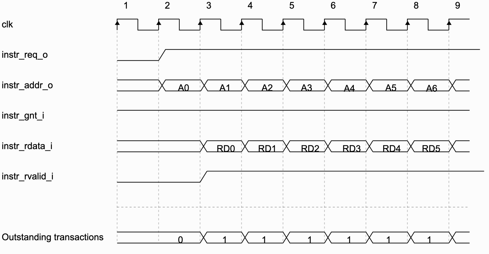
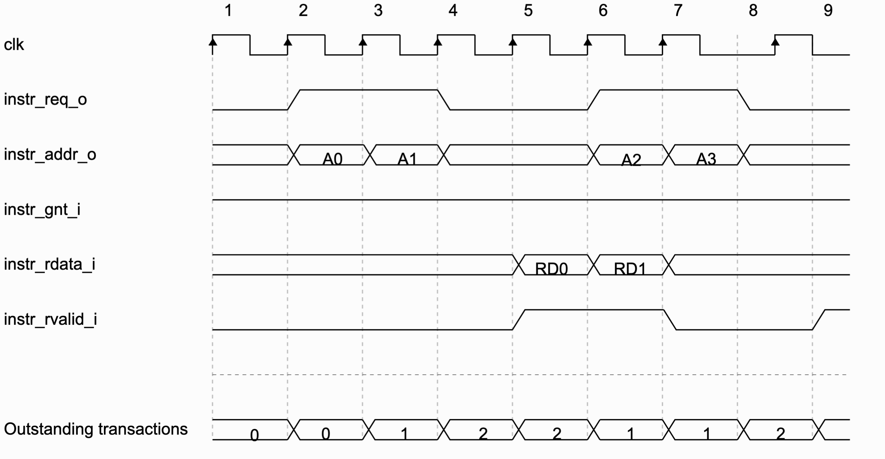

# CV32E40P

- [GitHub](https://github.com/openhwgroup/cv32e40p)
- [Docs](https://docs.openhwgroup.org/projects/cv32e40p-user-manual/en/latest/)


## Введение

Уменьшенное (по сравнению с CVA6) 32-битное ядро RISC-V с насыщенным
функционалом и документацией, которое продолжает развиваться.

CV32E40P - это софт-процессорное ядро написанное OpenHWGroup на SystemVerilog,
обладает 32-битной архитектурой. Общая схема представлена ниже:


Ядро реализует RV32I, а также следующие стандартные расширения:

| Название     | Описание                                          |
| ------------ | ------------------------------------------------- |
| **C**        | Расширение для сжатых инструкций                  |
| **M**        | Расширения для целочисленного деления и умножения |
| **Zicntr**   | Счётчики производительности                       |
| **Zicsr**    | Инструкции для контроля и регистра статуса        |
| **Zifencei** | Механизм получения инструкций                     |

Дополнительно могут быть подключены:

| Название  | Описание                                                             |
| --------- | -------------------------------------------------------------------- |
| **F**     | Расширение для операций с вещественными числами (одинарной точности) |
| **Zfinx** | X регистры для расширения F                                          |

Ядро имеет опциональные нестандартные расширения для работы с PULP (Parallel
Ultra-Low-Power):

| Название   | Описание                |
| ---------- | ----------------------- |
| **Xcv**    | CORE-V PULP ISA         |
| **Xcvelw** | CORE-V PULP Cluster ISA |


## Заметки

CV32E40P не является системой на кристале, поэтому не имеет встроенной памяти
инструкций и памяти данных, во многом это может быть полезно и удобно, так как
процессор не навязывает конкретных реализация и даёт разработчику возможность
самостоятельно определить эти блоки.

Такое решение также может быть удобно в случае реализации косимуляции
процессора RISC-V, где инструкции будут подаваться на процессор с компьютера,
таким образом можно реализовать специфичный Instruction Memory, который будет
обращаться к компьютеру по UART и выдвать инструкцию словно сам их хранит.


### Instruction Memory - описание

Процессор даёт строгую спецификацию к пямяти инструкций и ожидает от неё
заданного поведения, далее будет описано, что мы смогли выяснить и реализовать.

Первое с чего стоит начать, описание входов и выходов, они приведены ниже с
указанием разрядности каждого:

- `instr_addr_o[31:0]`
- `instr_req_o`
- `instr_gnt_i`
- `instr_rvalid_i`
- `instr_rdata_i[31:0]`

~~Интересно, что они придерживаются конвенции, где _o на конце обозначает
выходной сигнал, а _i входной, возможно, стоит взять на заметку~~

`instr_addr_o` адрес запрашиваемой инструкции, выровнен по машинному слову,
добавить нечего.

`instr_req_o` сигнал, обозначающий, что запрос всё ещё актуален, остаётся
истинным до тех пор, пока `instr_gnt_i` не будет истинным хотя бы один такт.

`instr_gnt_i` обозначает, что принимающая сторона приняла запрос и процессор
может выдать следующий запрос.

`instr_rdata_i` содержит запрошенные данные...

`instr_rvalid_i` обозначает, что данные на выходе актуальны, должен оставаться
истинным не более чем на один такт для одного запроса.

Было замечено, что процессор не обязывает отвечать за один такт, это позволяет
производить более затратные операции во время запроса инструкций, например,
передача или получение данных извне.

Пример временной диаграмы обращения к памяти инструкций:



Также процессор имеет возможность работать с instruction memory по транзакциям,
пример такого поведения:




### Instruction Memory - реализация

Для загрузки на плату нам потребубется реализовать память инструкций
самостоятельно, поэтому сделаем простейшую реализацию, которая будет выполнять
требования интерфейса, пример приведён ниже.

```verilog
module inst_mem (
    input             clk,
    input      [31:0] addr,
    input             req_valid,
    output            accepted,
    output reg        rvalid,
    output reg [31:0] rdata
);
    reg [31:0] mem [255:0];
    assign accepted = 1'b1;

    always @(posedge clk) begin
        if (req_valid) begin
            rdata = mem[31:2];
            rvalid = 1'b1;
        end else begin
            rvalid = 1'b0;
        end
    end

endmodule
```


### Загрузка на плату

Для загрузки на плату всё готово, создаём пустой проект для de1-soc через
утилиту system_cd, добавляем все необходимые файлы, создаём модуль процессора и
памяти в верхнеуровневом файле и соединяем нужные входы и выходы, запускаем
процесс синтеза... получаем ошибку...

При выяснении причин ошибок отправляемся в файл
`cv32e40p_register_file_latch.sv` и видим следующее:

```systemverilog
...

  if (FPU == 1 && ZFINX == 0) begin
    // Floating point registers
    always_latch begin : latch_wdata_fp
      if (FPU == 1) begin
        for (l = 0; l < NUM_FP_WORDS; l++) begin : w_WordIter
          if (~rst_n) mem_fp[l] = '0;
          else if (mem_clocks[l+NUM_WORDS] == 1'b1)
            mem_fp[l] = waddr_onehot_b_q[l+NUM_WORDS] ? wdata_b_q : wdata_a_q;
        end
      end
    end
  end
endmodule
```

`FPU` и `ZFINX` являются задаваемыми параметрами, замысел конструкции понятен,
но он, вроде как, нарушает синтаксис verilog, который позволяет использовать
`if` только внутри цикла `always`.

Исправлять ошибки (ошибки ли это? может так и задумано) мы посчитали странным,
так как не до конца ясна микроархитектура процессора и замысел этих
конструкций, поэтому исследование этого процессора отложено на время, пока не
будет выяснено, что это значит и почему так было сделано.
