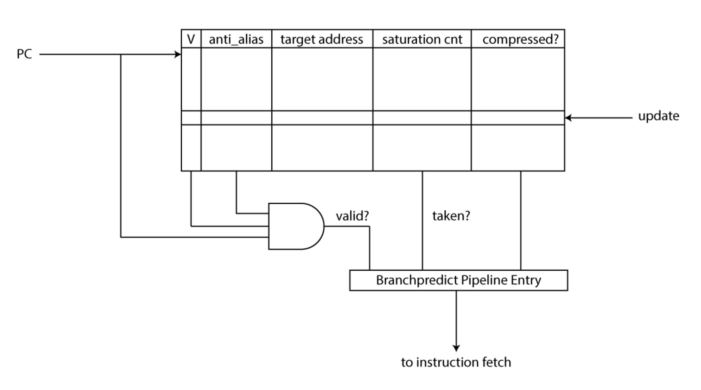

# CVA6

CVA6 - 64-разрядное ядро с 6-ступенчатым конвейером (Рис. 1). В данном
процессоре реализованы 3 уровня привилегий M, S, U для полной поддержки
Unix-подобных операционных систем. По данной причине основным назначением
процессора является запуск полноценной операционной системы. Отличительной
особенностью данной реализации является наличие 6 стадий конвейера в отличие от
классического конвейера с 5 стадиями.

Еще одной особенностью является наличие PC Generation, который отвечает за
вычисление адреса следующей инструкции, а также за учёт ветвлений в данном
процессе. Он имеет специальные блоки BHT (Branch History Table), содержащий
историю “прыжков” PC, и BTB (Branch Target Buffer), который является буфером
ветвления. Также PC Generation на основе истории ветвлений направлен на
прогнозирование будущих ветвлений (Рис. 2).

Также есть возможность декодировать сокращенные команды, которые занимают 16
бит, а не 32, как в классическом варианте.

Есть возможность работы с CSR инструкцией, при этом для работы с ней создан
отдельный буфер, так как инструкция CSR изменяет состояние архитектуры.

Кроме этого есть в данном процессоре есть возможность работы с CSR-инструкцией.
Для этого создан отдельный буфер ввиду того, что инструкция CSR изменяет
состояние архитектуры.
