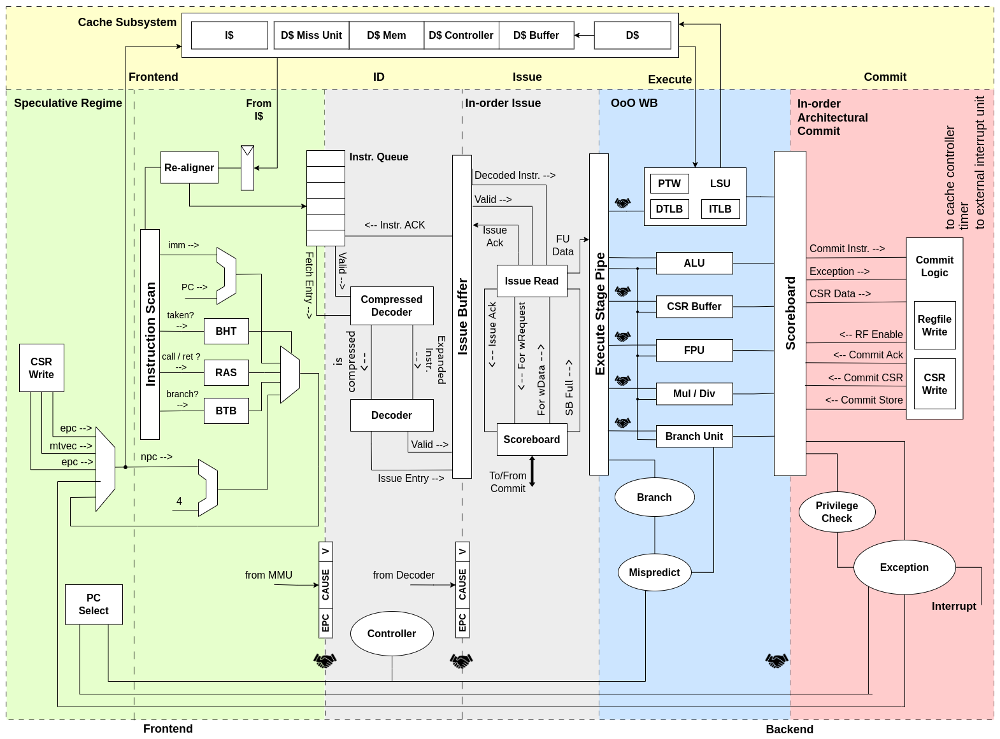

# Отчёт от 30.10.2023

## О чём?

Рассмотрели список ядер по ссылке
<https://github.com/riscvarchive/riscv-cores-list/blob/master/README.md>.
Выбрали несколько ядер для первоочередного рассмотрения.  

Критерии отбора:
- Открытая лицензия
- Язык: Verilog или System Verilog

## Результаты

Первым делом отфильтровали весь список по требованиям, представленным выше,
получили список из 19 ядер, удовлетворяющих этим требованиям:

| Название                   | Репозиторий                                         |
| -------------------------- | --------------------------------------------------- |
| CV32E40P                   | <https://github.com/openhwgroup/cv32e40p>           |
| Ibex (formerly Zero-riscy) | <https://github.com/lowRISC/ibex>                   |
| CVA6                       | <https://github.com/openhwgroup/cva6>               |
| OPenV/mriscv               | <https://github.com/onchipuis/mriscv>               |
| Roa Logic RV12             | <https://github.com/roalogic/RV12>                  |
| SCR1                       | <https://github.com/syntacore/scr1>                 |
| Hummingbird E200           | <https://github.com/SI-RISCV/e200_opensource>       |
| PicoRV32                   | <https://github.com/cliffordwolf/picorv32>          |
| SERV                       | <https://github.com/olofk/serv>                     |
| SweRV EH1                  | <https://github.com/chipsalliance/Cores-SweRV>      |
| SweRV EL2                  | <https://github.com/chipsalliance/Cores-SweRV-EL2>  |
| SweRV EH2                  | <https://github.com/chipsalliance/Cores-SweRV-EH2>  |
| biRISC-V                   | <https://github.com/ultraembedded/biriscv>          |
| DarkRISCV                  | <https://github.com/darklife/darkriscv>             |
| SSRV                       | <https://github.com/risclite/SuperScalar-RISCV-CPU> |
| Tinyriscv                  | <https://github.com/liangkangnan/tinyriscv>         |
| RSD                        | <https://github.com/rsd-devel/rsd>                  |
| Kronos                     | <https://github.com/SonalPinto/kronos>              |
| Steel                      | <https://github.com/rafaelcalcada/steel-core>       |

## Заинтересовавшие ядра

- SCR1
- CVA6
- PicoRV32

## Что дальше?

Выберем три ядра и копнём глубже в их документацию, постараемся ознакомится с
микроархитектурой и устройством каждого из них, а также оценим их
функциональные возможности.

## CVA6 - первое мнение

CVA6 - процессорное ядро risc-v с 6-ступенчатым конвейером, имеет отдельный
сайт с документацией по использованию и устройству
(<https://docs.openhwgroup.org/projects/cva6-user-manual/>), для каждой стадии
есть отдельный блок документации, в целом, перые впечатления приятные,
документация выглядит досаточно подробной, а репозиторий имеет неплохую
активность.

## SCR1 - первое мнение

Документация (<https://github.com/syntacore/scr1/tree/master/docs>) не выглядит
дружелюбной на первый взгляд, но углубившись лучше можно заметить, что
отдельный блоки описаны достаточно подробно, в том числе имеются временные
диаграммы.

## PicoRV32 - первое мнение

Изначально подавал большие надежды, но документация оставляет желать лучшего,
кроме README других заметок по архитектуре нет, но возможно мы ошибаемся и ещё
не нашли то, что нужно. Также следует отметить, что репозиторий не обновляется
уже как 2 года. Из интересного: всё описание ядра содержится в одном verilog
файле, несмотря на описанные выше недостатки, ознакомиться стоит.

## CVA6 - углубление

Особенностью данной реализации является наличие 6-ти стадий конвейера, в
отличие от классического конвейера с 5-ю стадиями.

PC Generation отвечает за вычисление адреса следующей инструкции, а также учёт
ветвлений в данном процессе. Имеет специальные блоки BHT (Branch History
Table), содержащий историю “прыжков” PC, и BTB (Branch Target Buffer) буфер
ветвления. Также PC Gen на основе истории ветвлений пытается предсказывать
грядущие ветвления.

Также есть возможность декодировать сокращенные команды, которые занимают 16
бит, а не 32, как в классическом варианте.

Есть возможность работы с CSR инструкцией, при этом для работы с ней создан
отдельный буфер, так как инструкция CSR изменяет состояние архитектуры.

Обзор микроархитектуры проводился на основе приложенной документации
<https://docs.openhwgroup.org/projects/cva6-user-manual/03_cva6_design/intro.html>
