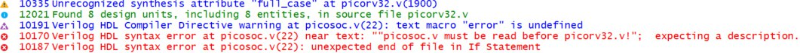
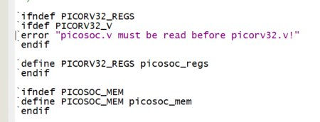
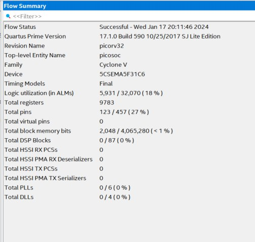

# Отчёт от 08.01.2024

## О чем?

Углубление в процессор PicoRV32, создание пробного проекта с данным процессором
в Quartus.

## Результаты

Начали с клонирования репозитория с файлами процессора. Далее создали проект
picorv32 (пока без привязки к плате, так как еще полноценно не разобрались в
интерфейсах процессора, поэтому в разделе device выбрали случайную плату).

Добавили в проект следующую модули:
- picorv32.v (файл, в котором реализован сам процессор PicoRV32)
- picosoc.v (верхнеуровневый файл системы на кристалле)
- spimemio.v (файл модуля флеш памяти с интерфейсом SPI)
- simpleuart.v (файл модуля для работы с UART)

Далее выставили верхнеуровневый файл picosoc.v и запустили компиляцию проекта.
В итоге получили следующую ошибку:

Нашли место, в котором происходит ошибка.

В результате данный проект требует определенный порядок компиляции файлов, но
так как в Quartus мы задаем Top-Level Entity, то порядок компиляции
определяется автоматически. Поэтому мы комментируем данную ошибку, повторяем
компиляцию и получаем успешно скомпилированный проект.

В итоге получаем:

- почти 6000 LUT, однако в документации заявлено 750-2000 LUT, но в архитектуре
  Xilinx 7й серии
- 9783 регистров
- 2048 бит памяти

## Прочее

Нашли интересную статью по смежному направлению, где реализовывали
криптографический SoC (на основе PicoRV32)
<https://www.researchgate.net/publication/361843646_Design_of_an_Integrated_Cryptographic_SoC_Architecture_for_Resource-Constrained_Devices>

Всех С Новым Годом!
