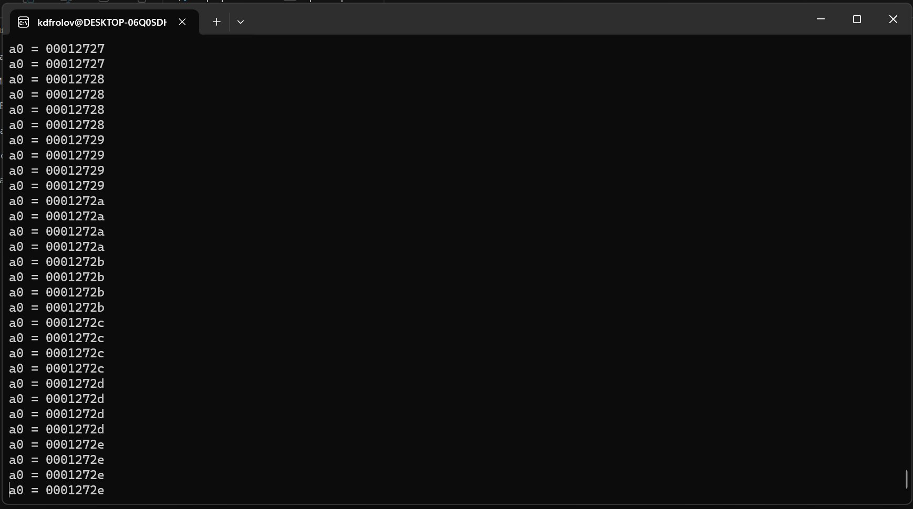
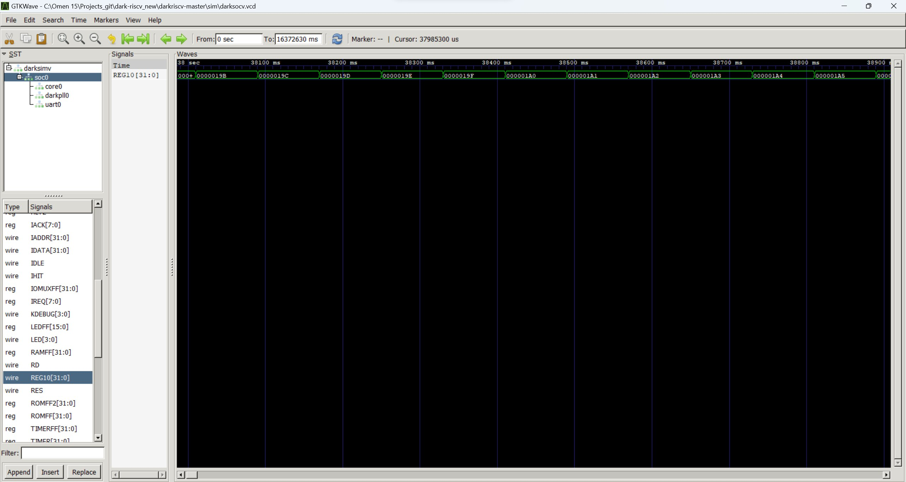
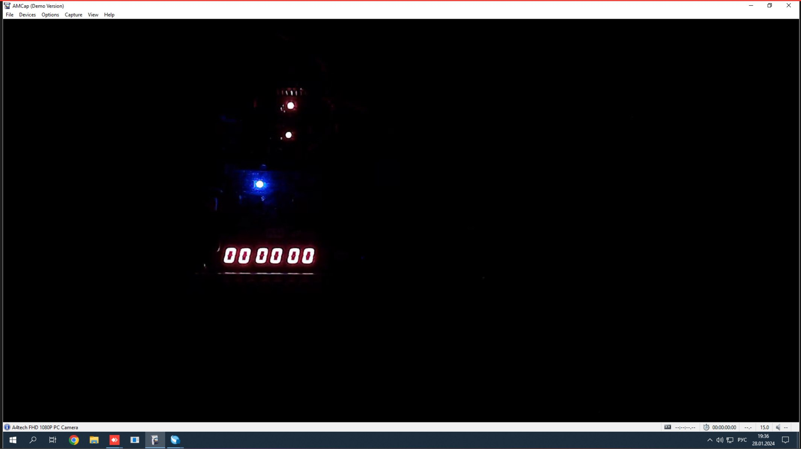
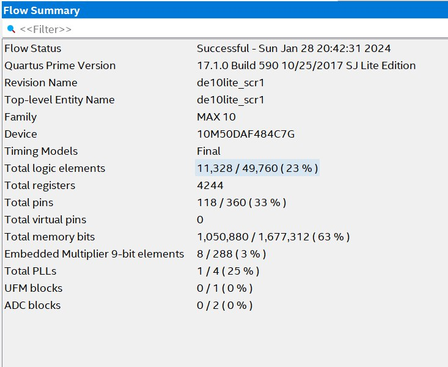

# Отчёт от 28.01.2024


## Результаты

- Успешная симуляция работы программы на DarkRISCV
- Успешный синтез SCR1 через подготовленный sdk
- Пообщались с ребятами из Digital Design Community


## DarkRISCV

В прошлый раз у нас получилось синтезировать ядро и загрузить его на плату, но
мы не могли проверить его работоспособность, поэтому на этой неделе мы решили
написать программу-счетчик (3 строки на ассемблере) и загрузить её вместо
заготовленной программы-загрузчика.


### Подготовка к загрузке

Для начала был добавлен вывод регистра x10 на семисегментные дисплей, был взят
модуль конвертации двоичного значения в формат семисегментного дисплея и
пременён для вывода, также был написан простой делитель тактов для уменьшения
частоты до наблюдаемого уровня.

Подключение выводов схемы к darkriscv:
```verilog
wire clk;

wire [31:0] REG10;

clk_devider devider (
	CLOCK_50,
	clk,
);

darksocv soc (
	.XCLK     ( clk ),
	.XRES     ( GPIO_0[14] ),

	.UART_RXD (),
	.UART_TXD (),

	.LED      (),
	.DEBUG    (),

	.REG10 ( REG10 )
);

assign LEDR [9:0] = REG10 [9:0];

sm_hex_display hex0 (REG10[3:0], HEX0);
sm_hex_display hex1 (REG10[7:4], HEX1);
sm_hex_display hex2 (REG10[11:8], HEX2);
sm_hex_display hex3 (REG10[15:12], HEX3);
sm_hex_display hex4 (REG10[19:16], HEX4);
sm_hex_display hex5 (REG10[24:20], HEX5);
```

Модуль для деления тактов:
```verilog
module clk_devider #(
    parameter dev = 20
)(
    input clkIn,
    output clkOut
);
    reg [31:0] cnt;
    always @(posedge clkIn)
        cnt = cnt + 1'b1;
    assign clkOut = cnt[dev];
endmodule
```

Модуль для конвертации:
```verilog
module sm_hex_display
(
    input      [3:0] digit,
    output reg [6:0] seven_segments
);

    always @*
        case (digit)
        'h0: seven_segments = 'b1000000;  // g f e d c b a
        'h1: seven_segments = 'b1111001;
        'h2: seven_segments = 'b0100100;  //   --a--
        'h3: seven_segments = 'b0110000;  //  |     |
        'h4: seven_segments = 'b0011001;  //  f     b
        'h5: seven_segments = 'b0010010;  //  |     |
        'h6: seven_segments = 'b0000010;  //   --g--
        'h7: seven_segments = 'b1111000;  //  |     |
        'h8: seven_segments = 'b0000000;  //  e     c
        'h9: seven_segments = 'b0011000;  //  |     |
        'ha: seven_segments = 'b0001000;  //   --d-- 
        'hb: seven_segments = 'b0000011;
        'hc: seven_segments = 'b1000110;
        'hd: seven_segments = 'b0100001;
        'he: seven_segments = 'b0000110;
        'hf: seven_segments = 'b0001110;
        endcase

endmodule
```

Программа счётчик:
```
.text

        add a0, zero, zero
loop:   addi a0, a0, 1
        j loop
```


### Симуляция проекта

Для симуляции нужно скомпилировать файлы проекта с помощью Icarus Verilog и
запустить выходной файл.



Для рассмотрения вейвформ нужно выданный в результате симуляции vdc файл
передать в gtkwave.




### Загрузка на плату

После успешной симуляции произвели загрузку проекта на плату, но к сожалению ни
на семисегментном дисплее, ни на диодах результат работы счетчика не появился.




## SCR1

Постарались начать продвижение в изучении ядра SCR1 и обратили на него
ПРИСТАЛЬНОЕ ВНИМАНИЕ.

В репозитории scr1 есть ссылка на [SDK](https://github.com/syntacore/scr1-sdk)
для загрузки на fpga с заготовленными программами, в числе подготовленных к
загрузке fpga есть и de10-lite, который имеется у нас в лаборатории, так что
всё хорошо. *Может быть есть смысл портировать на De1-SoC*.

Был клонирован репозиторий с SDK и была произведена попытка синтеза ядра:



## Социализация

Задали интерезующие нас вопросы в Digital Design Community, в частности о SCR1
и общем подходе к изучению новых ядер.

На наш вопрос дал развёрнутый ответ Виктор Дашонок, специалист по развитию
образовательных программ YADRO, от него получили следующее:

- Ссылку на SCR1 SDK
- Ссылку на задачник по программированию
- Ссылку на список ядер от risc-v (Но не все ядра там свободные)
- Предложение предоставить Early Access Kit
- Обещание связать с кем-то из специалистов

Также получили отческий совет от Юрия Панчула об общем подходе к изучению новых
ядер.

Благодарны за полученные ответы.
